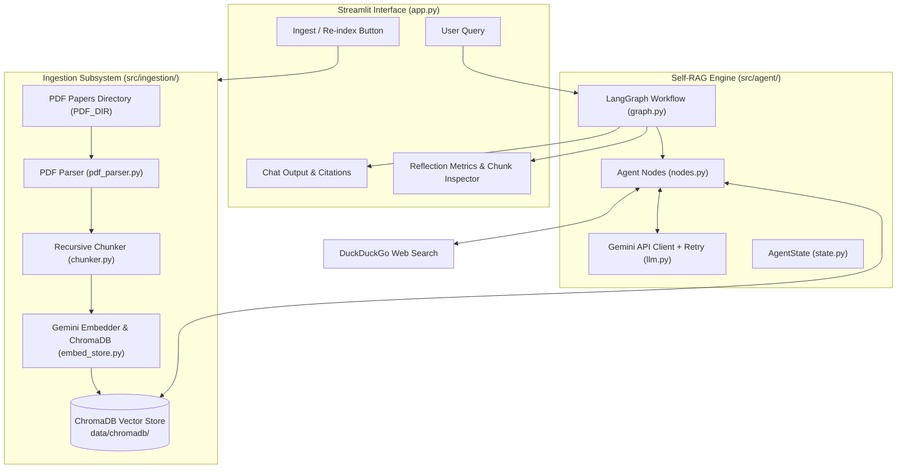
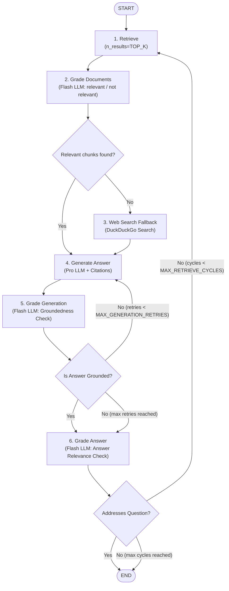
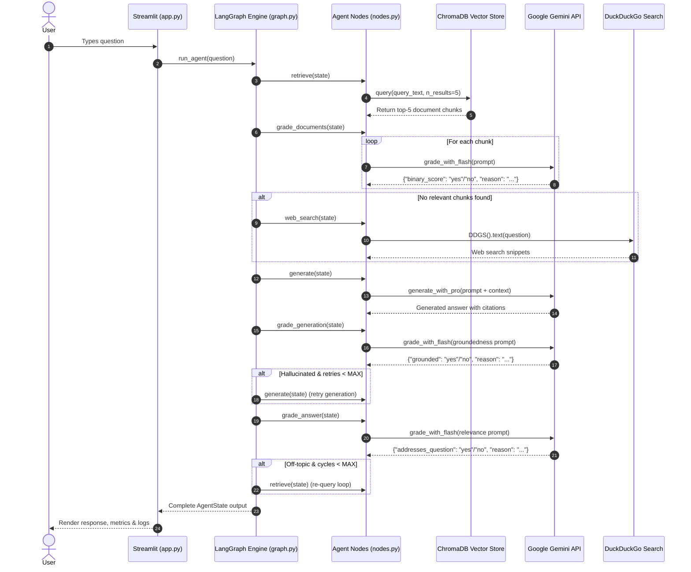

# 🏗️ Academic Self-RAG Agent Architecture

This document provides a comprehensive architectural breakdown of the **Academic Self-RAG Agent**, a multi-paper research assistant powered by **Self-Reflective Retrieval-Augmented Generation (Self-RAG)**, **LangGraph**, **ChromaDB**, and **Google Gemini**.

---

## 📌 Executive Summary

Standard RAG architectures often suffer from two major failure modes:
1. **Retrieval Failure**: Fetching irrelevant context that pollutes the LLM prompt.
2. **Generation Failure**: Generating responses that either hallucinate facts not found in the retrieved context or fail to answer the user's specific prompt.

The Academic Self-RAG Agent resolves these issues by embedding self-reflection loops directly into the state graph execution flow. At each stage, lightweight LLM evaluators grade document relevance, hallucination/groundedness, and answer satisfaction before committing to a final output—falling back to live web search when local academic paper knowledge is insufficient.

---

## 🏛️ High-Level System Architecture

The project consists of three core subsystems:
1. **Ingestion Pipeline**: Parses PDF research papers, extracts reading-order text, generates recursive chunk overlays, produces vector embeddings using Gemini, and stores them in a persistent ChromaDB vector index.
2. **LangGraph Self-RAG Engine**: Manages the state machine, document retrieval, relevance grading, generation, hallucination checking, answer evaluation, and conditional routing loops.
3. **Streamlit UI & Control Dashboard**: Provides an interactive chat interface, execution logging, retrieved chunk inspection, and visual metric dashboards (document relevance breakdown, groundedness status, and web fallback previews).



---

## 🔄 Self-RAG LangGraph State Machine

The core orchestration engine is compiled as a `StateGraph` in [`src/agent/graph.py`](file:///home/shanujya/academic-rag-agent/src/agent/graph.py). It maintains state across node executions using `AgentState`.

### LangGraph Workflow Diagram



### Detailed Node Specifications

| Node Name | Handler Function | Primary Responsibilities | Model / Service Used |
| :--- | :--- | :--- | :--- |
| **`retrieve`** | `nodes.retrieve` | Queries ChromaDB using vector similarity for top $K$ chunks matching the query text. Computes cosine retrieval score ($1 - \text{distance}$). | `ChromaDB` (Persistent) |
| **`grade_documents`** | `nodes.grade_documents` | Filters retrieved chunks by evaluating relevance against user question. Attaches grade reasons. | `gemini-flash-lite-latest` (JSON mode, `temp=0.0`) |
| **`web_search`** | `nodes.web_search` | Executes when local paper chunks fail relevance grading. Fetches top 3 snippets via DuckDuckGo. | `duckduckgo_search` (DDGS) |
| **`generate`** | `nodes.generate` | Formulates structured prompt with graded document context or web fallback. Enforces inline paper citations. | `gemini-flash-latest` (`temp=0.2`) |
| **`grade_generation`** | `nodes.grade_generation` | Self-RAG hallucination check: verifies whether generated claims are strictly supported by context facts. | `gemini-flash-lite-latest` (JSON mode, `temp=0.0`) |
| **`grade_answer`** | `nodes.grade_answer` | Self-RAG answer relevance check: evaluates if the output directly addresses the user's intent. | `gemini-flash-lite-latest` (JSON mode, `temp=0.0`) |

---

## 📂 Subsystem Deep Dive

### 1. Ingestion Subsystem (`src/ingestion/`)

```
src/ingestion/
├── pdf_parser.py    # Layout-aware PDF reading-order text extraction
├── chunker.py       # Recursive text splitting with section preservation
├── embed_store.py   # Custom ChromaDB EmbeddingFunction using Gemini API
└── ingest.py        # End-to-end ingestion pipeline orchestrator
```

* **Layout-Aware PDF Extraction ([`pdf_parser.py`](file:///home/shanujya/academic-rag-agent/src/ingestion/pdf_parser.py))**:
  * Utilizes `PyMuPDF` (`pymupdf.open`) to extract page blocks.
  * Sorts page text blocks by vertical and horizontal bounds `(round(y0, 1), round(x0, 1))` to preserve accurate reading order in multi-column academic paper layouts.
* **Recursive Section-Aware Chunking ([`chunker.py`](file:///home/shanujya/academic-rag-agent/src/ingestion/chunker.py))**:
  * Hierarchical separator progression: `["\n\n", "\n", ". ", " ", ""]`.
  * Preserves section headings and natural paragraph structures. Default `CHUNK_SIZE=1000` chars with `CHUNK_OVERLAP=200` chars.
  * Produces `TextChunk` objects with source metadata and chunk indices.
* **Vector Store & Embeddings ([`embed_store.py`](file:///home/shanujya/academic-rag-agent/src/ingestion/embed_store.py))**:
  * Implements `GeminiEmbeddingFunction` extending `chromadb.api.types.EmbeddingFunction`.
  * Calls Gemini API `models.embed_content` using model `gemini-embedding-2`.
  * Creates/loads persistent ChromaDB collection (`academic_papers`) configured with Cosine Distance (`hnsw:space = cosine`).
  * Generates deterministic unique document IDs formatted as `<source_filename>::<chunk_index>`. Upserts in batches of 32.

---

### 2. State & Rate-Limit Resilient LLM Layer (`src/agent/`)

```
src/agent/
├── state.py         # AgentState TypedDict declaration
├── llm.py           # Gemini SDK wrapper + 429 rate limit backoff
├── nodes.py         # Node functions for LangGraph workflow
└── graph.py        # StateGraph structure & conditional edge routing
```

* **State Schema ([`state.py`](file:///home/shanujya/academic-rag-agent/src/agent/state.py))**:
  Tracks full conversation and execution state across graph iterations:
  ```python
  class AgentState(TypedDict):
      question: str
      documents: list[Document]
      relevant_documents: list[Document]
      web_context: str
      generation: str
      steps_log: Annotated[list[str], operator.add]  # Accumulative log reducer
      generation_retries: int                        # Circuit-breaker counter
      retrieve_cycles: int                           # Circuit-breaker counter
      grade_documents_result: dict
      grade_generation_result: dict
      grade_answer_result: dict
  ```

* **Gemini API & Rate Limit Resilience ([`llm.py`](file:///home/shanujya/academic-rag-agent/src/agent/llm.py))**:
  * Intercepts `429 RESOURCE_EXHAUSTED` errors from the Gemini API free tier.
  * Uses regex pattern matching on exception strings to parse server-suggested retry delays (e.g. `retry in 58.2s`), adding a safety margin before retrying automatically (up to 4 retry attempts).
  * Uses `gemini-flash-lite-latest` for fast JSON grading tasks (`response_mime_type="application/json"`).
  * Uses `gemini-flash-latest` for qualitative answer synthesis.

---

### 3. User Interface Layer ([`app.py`](file:///home/shanujya/academic-rag-agent/app.py))

Built with **Streamlit** and **Altair**, the web frontend provides complete operational visibility:
* **Sidebar Control Panel**: Displays total local PDFs in source directory, total indexed vectors in ChromaDB, an **Ingest / Re-index** execution button, and real-time execution step logs.
* **Chat Console**: Native Streamlit `st.chat_input` and `st.chat_message` conversation flow.
* **Inspectable Diagnostic Panels**:
  * **Retrieved Chunks**: Expandable view of top-$K$ chunks with source file names and calculated similarity scores.
  * **Self-Reflection Metrics**: Dataframe and Altair bar graph displaying per-document relevance decisions, alongside metric cards for Groundedness check (`grounded`) and Answer Relevance check (`addresses_question`).

---

## 📊 End-to-End Execution Sequence



---

## ⚙️ Configuration & Hyperparameters

All global configuration settings are centralized in [`config.py`](file:///home/shanujya/academic-rag-agent/config.py):

| Variable Name | Value | Purpose |
| :--- | :--- | :--- |
| `PDF_DIR` | `/home/shanujya/llm_paper` | Absolute path to local PDF research papers library |
| `CHROMA_DIR` | `<PROJECT_ROOT>/data/chromadb` | Path for persistent vector database storage |
| `COLLECTION_NAME` | `"academic_papers"` | Name of the ChromaDB collection |
| `EMBED_MODEL` | `"gemini-embedding-2"` | Gemini embedding model |
| `FLASH_MODEL` | `"gemini-flash-lite-latest"` | Fast LLM used for structured JSON reflection grading |
| `PRO_MODEL` | `"gemini-flash-latest"` | Main LLM used for synthesized academic answer generation |
| `TOP_K` | `5` | Number of document chunks retrieved per search query |
| `CHUNK_SIZE` | `1000` | Maximum character length of text chunks |
| `CHUNK_OVERLAP` | `200` | Character overlap between adjacent chunks |
| `MAX_GENERATION_RETRIES` | `2` | Maximum generation retries allowed on hallucination detection |
| `MAX_RETRIEVE_CYCLES` | `2` | Maximum retrieval cycles allowed if answer fails relevance check |

---

## 🛡️ Reliability & Security Considerations

1. **Self-Correction & Infinite Loop Prevention**:
   * Conditional edges evaluate strict integer thresholds (`generation_retries >= MAX_GENERATION_RETRIES` and `retrieve_cycles >= MAX_RETRIEVE_CYCLES`) to guarantee bounded execution graph termination.
2. **API Rate-Limit Backoff**:
   * Automatic exception parsing for HTTP 429 status codes prevents cascading script failures during free-tier Gemini API usage.
3. **Environment Security**:
   * API credentials are isolated in `.env` (git-ignored). Client functions validate environment key availability before initiating network calls.
4. **Layout-Preserving Text Processing**:
   * PyMuPDF block coordinate sorting avoids text scrambling across dual-column journal pages.
